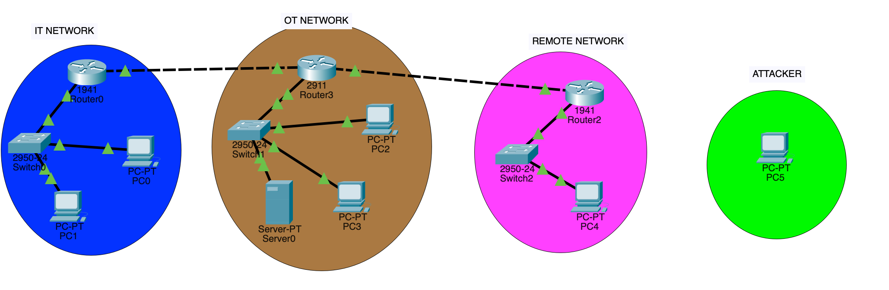
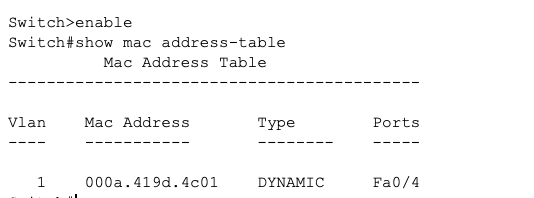
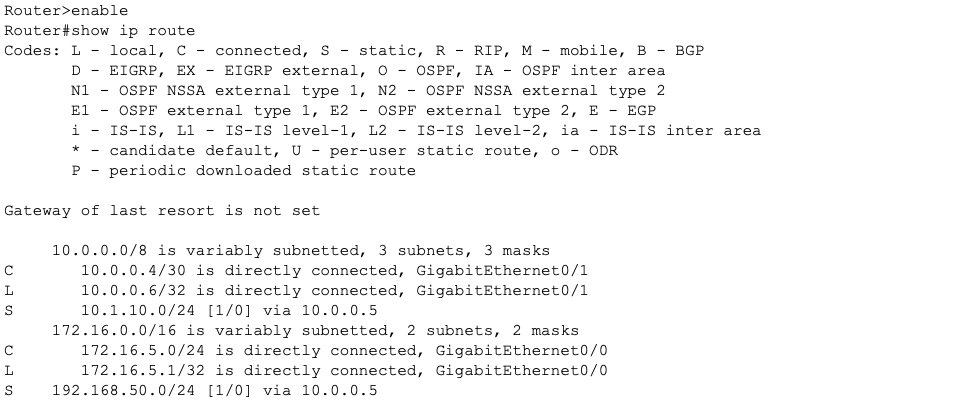
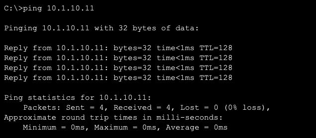
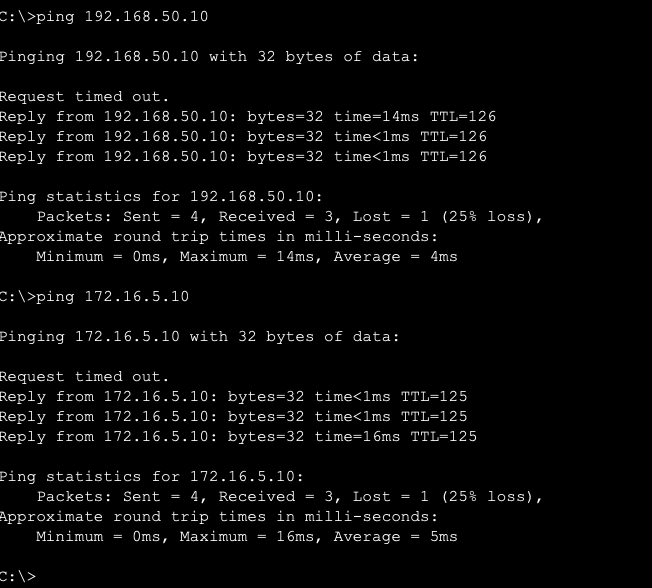
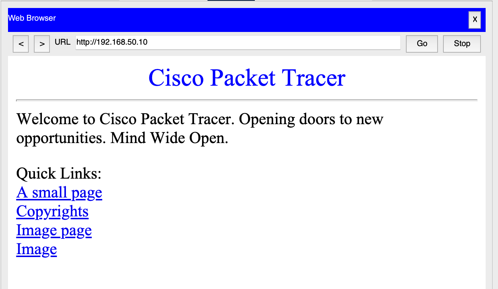
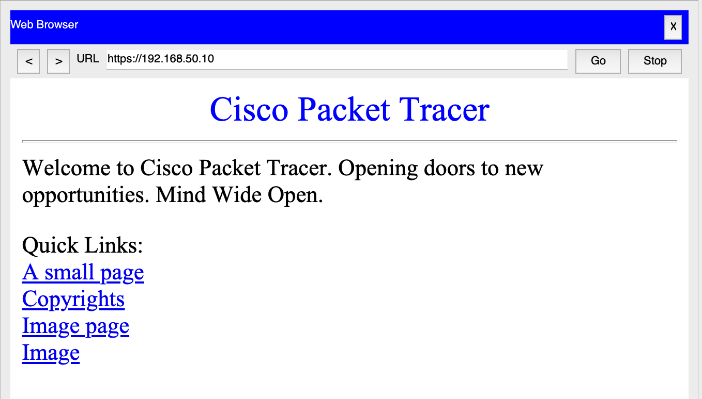
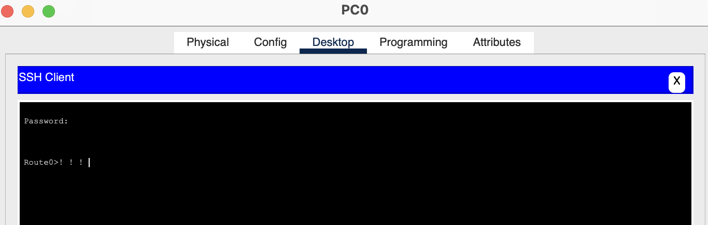
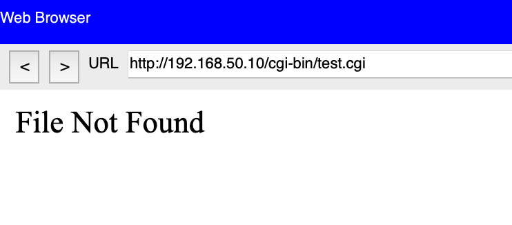

# Lab 04: Enterprise LAN Security Assessment

## Name: Sadeem Alanazi
## Course: IT 355   

---

# Part 1: Network Architecture

## Network Topology

---

## MAC Address Table

**Explanation:**  
The MAC address table shows how a switch maps MAC addresses to specific ports, allowing efficient frame forwarding at Layer 2.

---

## Routing Table

**Explanation:**  
The routing table shows how routers determine the path for forwarding packets between networks using destination IP and next-hop addresses.

---

## Connectivity Tests

### Same Network Ping

### Cross Network Ping

---

## OSI Layer Mapping

- **Layer 1 (Physical):** Cables and connections  
- **Layer 2 (Data Link):** MAC addresses and switching  
- **Layer 3 (Network):** IP addressing and routing  
- **Layer 4 (Transport):** TCP and UDP  
- **Layer 7 (Application):** HTTP, HTTPS, SSH  

---

# Part 2: Protocol Security

## HTTP vs HTTPS
  

**Explanation:**  
HTTPS secures communication using the Transport Layer Security (TLS) protocol, which begins with a handshake process between the client and server. During this handshake, asymmetric encryption is used to securely exchange a symmetric session key. The server presents a digital certificate that is validated by a trusted Certificate Authority (CA), ensuring server authenticity. Once the session key is established, symmetric encryption is used for efficient and secure data transmission. This process ensures confidentiality, integrity, and authentication. Additionally, HTTPS protects against man-in-the-middle (MITM) attacks by verifying server identity and using message authentication codes (MACs) to detect data tampering. In contrast, HTTP transmits data in plain text, making it vulnerable to interception and manipulation.

---

## TCP vs UDP

TCP is a connection-oriented protocol that establishes communication using a three-way handshake consisting of SYN, SYN-ACK, and ACK messages. This process ensures both devices are synchronized before data transmission, providing reliable and ordered delivery. Because TCP maintains a stateful connection, it allows firewalls and intrusion detection systems (IDS) to monitor sessions more effectively, improving visibility and security. In contrast, UDP is a connectionless protocol that sends data without establishing a session, making it faster but less reliable. Since UDP does not maintain connection state, it is more difficult for firewalls and IDS systems to track, which can reduce visibility and make detecting malicious traffic more challenging.
---

## SSH Login

**Explanation:**  
SSH provides secure encrypted remote access, unlike Telnet which sends data in plain text. SSH uses encryption and secure key exchange mechanisms to protect credentials and session data, preventing eavesdropping and unauthorized access.

---

# Part 3: Shellshock Vulnerability

**Explanation:**  
Shellshock is a vulnerability in Bash that allows attackers to execute commands remotely through CGI scripts. This vulnerability exploits Bash environment variables, allowing attackers to inject and execute arbitrary commands remotely.

---

# Part 4: Incident Response

## Attack Path

Attacker → Router2 → Router3 → Web Server → SCADA devices 
This attack was successful due to insufficient input validation, lack of patching, and weak network segmentation controls.

---

## Root Cause Analysis

| Vulnerability | Issue | Fix |
|--------------|------|-----|
| Unpatched Software | Shellshock vulnerability | Update systems |
| Network Segmentation | Open access | Firewall / ACL |
| Access Control | Weak restrictions | Least privilege |
| Monitoring | No detection | IDS / logging |

---

## Remediation Plan

A multi-layered approach should be implemented, including patching systems, enforcing network segmentation, enabling monitoring tools, and applying zero trust principles.

---

# Reflection

This lab helped me understand how network architecture and security are connected. I learned how segmentation, routing, and protocols work together to protect systems. The Shellshock simulation showed how vulnerabilities can be exploited, and the incident response helped me understand how to defend against attacks.
